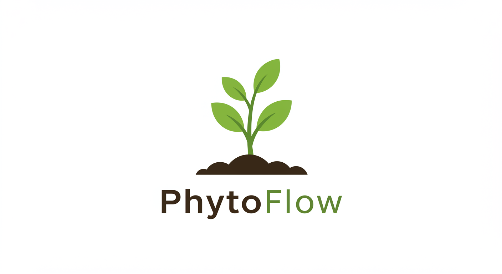

  
  
# PhytoFlow

## Um Sistema de Irrigação Inteligente
  
*Revolucionando a agricultura sustentável através da tecnologia IoT*

## 🌱 Sobre o Projeto

PhytoFlow é um sistema de irrigação inteligente que integra IoT, análise de dados e automação para revolucionar a gestão de recursos hídricos na agricultura de pequena escala. Nossa solução visa enfrentar desafios críticos da agricultura moderna, incluindo o desperdício de água, custos operacionais elevados e a necessidade de práticas agrícolas mais sustentáveis.

### Estatísticas Importantes

- 60% da água utilizada na agricultura é desperdiçada
- 34% dos reservatórios são afetados por uso ineficiente
- 82% da produção vem da agricultura familiar

## 🎯 Alinhamento com ODSs da ONU

O PhytoFlow contribui diretamente para diversos Objetivos de Desenvolvimento Sustentável da ONU:

### Impacto Ambiental

- **ODS 6**: Água Potável e Saneamento - Redução significativa no consumo de água
- **ODS 12**: Consumo e Produção Responsáveis - Diminuição do desperdício de recursos naturais
- **ODS 15**: Vida Terrestre - Promoção de práticas agrícolas sustentáveis

### Impacto Social

- **ODS 2**: Fome Zero - Aumento da produtividade e rentabilidade
- **ODS 4**: Educação de Qualidade - Capacitação de agricultores em tecnologias modernas
- **ODS 8**: Trabalho Decente e Crescimento Econômico - Democratização do acesso à tecnologia agrícola

## 💡 Características Principais

- **Monitoramento em Tempo Real**
  - Sensores de luz, umidade e temperatura
  - Sistema de alertas e notificações inteligentes
  - Fácil instalação e manutenção

- **Suporte a Múltiplas Culturas**
  - Mapeamento inteligente de terreno
  - Adaptação automática baseada em condições ambientais
  - Personalização por tipo de planta

## 🔧 Arquitetura

### Camadas do Sistema

1. **Dispositivos**
   - Sensores IoT
   - Microcontroladores ESP8266
   - Válvulas solenoides

2. **Comunicação**
   - Rede WiFi Mesh
   - Protocolo MQTT

3. **Apresentação**
   - Aplicativo mobile
   - Interface intuitiva

4. **Dados**
   - Armazenamento em nuvem
   - Carregamento em lote

## 👥 Equipe

- **Gabriel Castro** - Desenvolvedor FullStack & Especialista Arduino
- **Gabriel Milhomem** - Desenvolvedor Mobile
- **Vitor Lima** - Desenvolvedor Backend & Arquiteto de Soluções
- **Jair Rodrigues** - Desenvolvedor Backend & Tester

## 📝 Licença

MIT License

Copyright (c) 2024 PhytoFlow

Permission is hereby granted, free of charge, to any person obtaining a copy
of this software and associated documentation files (the "Software"), to deal
in the Software without restriction, including without limitation the rights
to use, copy, modify, merge, publish, distribute, sublicense, and/or sell
copies of the Software, and to permit persons to whom the Software is
furnished to do so, subject to the following conditions:

The above copyright notice and this permission notice shall be included in all
copies or substantial portions of the Software.

THE SOFTWARE IS PROVIDED "AS IS", WITHOUT WARRANTY OF ANY KIND, EXPRESS OR
IMPLIED, INCLUDING BUT NOT LIMITED TO THE WARRANTIES OF MERCHANTABILITY,
FITNESS FOR A PARTICULAR PURPOSE AND NONINFRINGEMENT. IN NO EVENT SHALL THE
AUTHORS OR COPYRIGHT HOLDERS BE LIABLE FOR ANY CLAIM, DAMAGES OR OTHER
LIABILITY, WHETHER IN AN ACTION OF CONTRACT, TORT OR OTHERWISE, ARISING FROM,
OUT OF OR IN CONNECTION WITH THE SOFTWARE OR THE USE OR OTHER DEALINGS IN THE
SOFTWARE.

---

  
  *Transformando a agricultura através da tecnologia sustentável* 🌱

